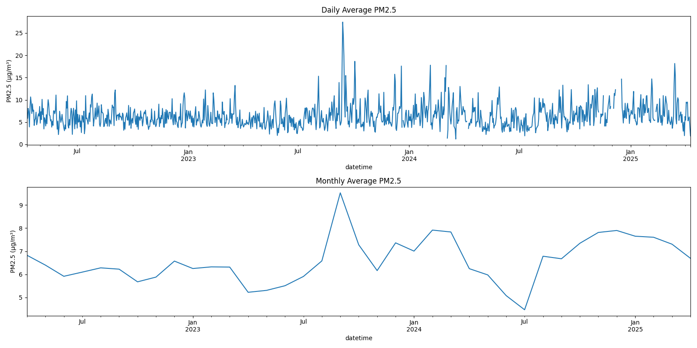

# PM2.5 Air Quality Analysis for Wollongong (2022-2025)



A comprehensive analysis pipeline for PM2.5 air quality data from Wollongong, Australia, featuring data cleaning, visualization, and time series analysis.

## Table of Contents
- [Features](#features)
- [Requirements](#requirements)
- [Installation](#installation)
- [Usage](#usage)
- [Data Structure](#data-structure)
- [Output Visualizations](#output-visualizations)
- [Key Findings](#key-findings)
- [Project Structure](#project-structure)
- [Contributing](#contributing)
- [License](#license)

## Features

✔ **Data Processing Pipeline**
   - Automatic handling of invalid/negative PM2.5 values
   - Datetime conversion and normalization
   - Missing data detection
   
📊 **Advanced Visualizations**
   - Interactive time series plots
   - Correlation heatmaps
   - Seasonal decomposition
   - Comparative year-over-year analysis
   
🔍 **Statistical Insights**
   - Rolling averages analysis
   - Monthly distribution patterns
   - Meteorological factor correlations

## Requirements

- Python 3.8+
- Required packages (see `requirements.txt`):
  ```
  pandas>=1.3.0
  matplotlib>=3.4.0
  seaborn>=0.11.0
  statsmodels>=0.12.0
  numpy>=1.21.0
  openpyxl>=3.0.0
  scikit-learn>=1.0.0
  ```

## Installation

1. Clone the repository:
   ```bash
   git clone https://github.com/yourusername/PM25-Wollongong-Analysis.git
   cd PM25-Wollongong-Analysis
   ```

2. Set up virtual environment:
   ```bash
   python -m venv .venv
   source .venv/bin/activate  # Linux/Mac
   .venv\Scripts\activate     # Windows
   ```

3. Install dependencies:
   ```bash
   pip install -r requirements.txt
   ```

## Usage

Run the complete analysis pipeline:
```bash
python src/main.py
```

For specific components:
```python
from src.data.loader import DataLoader
from src.visualization.plots import AQIVisualizer

# Load and clean data
loader = DataLoader("data/raw/Wollongong_09042022_10042025.xlsx")
df = loader.load_and_clean()

# Generate visualizations
visualizer = AQIVisualizer()
visualizer.plot_time_series(df)
```

## Data Structure

Input Excel file should contain:

| Column | Format | Description | Example |
|--------|--------|-------------|---------|
| date | DD/MM/YYYY | Measurement date | 09/04/2022 |
| time | HH:MM | Measurement time | 14:00 |
| temp_c | float | Temperature in °C | 17.8 |
| wind_speed_ms | float | Wind speed in m/s | 1.6 |
| pm25_ugm3 | float | PM2.5 concentration | 6.5 |
| humidity_pct | float | Relative humidity | 70.9 |

## Output Visualizations

| Visualization | Path | Description |
|---------------|------|-------------|
| Time Series | docs/images/pm25_time_series.png | Daily and monthly trends |
| Correlation | docs/images/feature_correlations_rolling.png | 7-day rolling correlations |
| Weekly Seasonality | docs/images/seasonal_decomposition_weekly.png | Weekly patterns |
| Annual Seasonality | docs/images/seasonal_decomposition_annual.png | Yearly cycles |
| Monthly Distribution | docs/images/monthly_boxplots.png | Monthly statistics |
| Year Comparison | docs/images/year_over_year_comparison.png | Interannual changes |

## Key Findings

### Data Quality Issues:
- Removed 3,146 invalid negative PM2.5 readings
- Corrected datetime formatting for midnight values (24:00 → 00:00)
- Identified 72 hours of missing data throughout the collection period

### Seasonal Patterns:
- Highest PM2.5 levels observed during winter months (June-August)
- Weekly cycles show weekend vs. weekday variations with lower PM2.5 on weekends
- Annual cycle shows clear winter peak and summer minimum

### Meteorological Correlations:
- Strong inverse relationship between PM2.5 and wind speed (r = -0.64)
- Temperature shows moderate negative correlation during winter (r = -0.42)
- Humidity positively correlated with PM2.5 during colder months (r = 0.38)

## Project Structure
```
PM25-Wollongong-Analysis/
├── data/
│   ├── raw/                  # Original Excel files
│   └── processed/            # Cleaned data
├── docs/
│   └── images/               # Generated visualizations
├── notebooks/                # Jupyter notebooks
├── src/
│   ├── data/                 # Data processing
│   │   ├── __init__.py
│   │   ├── loader.py
│   │   └── cleaner.py
│   ├── visualization/        # Plotting functions
│   │   ├── __init__.py
│   │   └── plots.py
│   ├── analysis/             # Statistical methods
│   │   ├── __init__.py
│   │   ├── statistics.py
│   │   └── seasonal.py
│   └── main.py               # Entry point
├── tests/                    # Unit tests
├── .gitignore
├── requirements.txt
└── README.md
```

## Contributing

1. Fork the project
2. Create your feature branch 
3. Commit your changes 
4. Push to the branch 
5. Open a Pull Request

## License

...