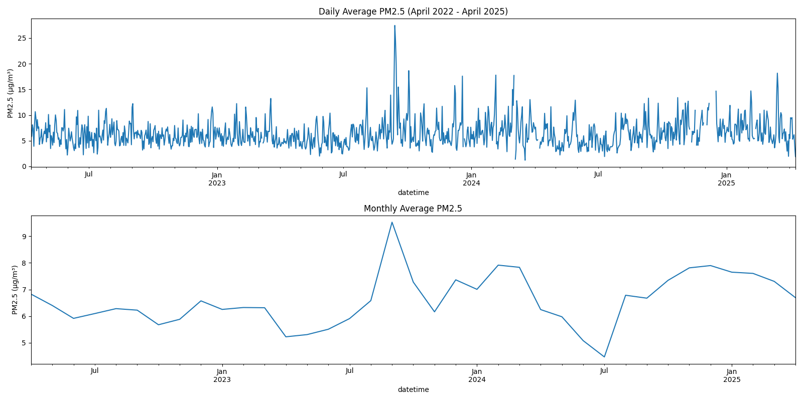
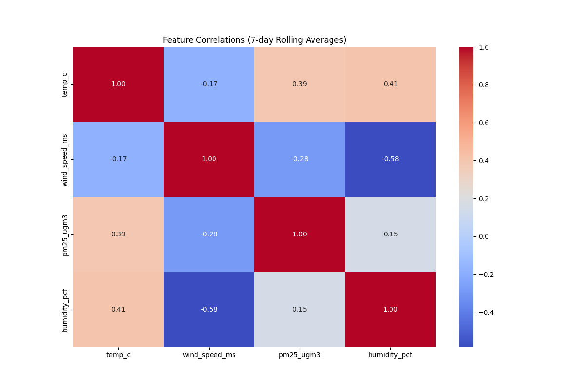
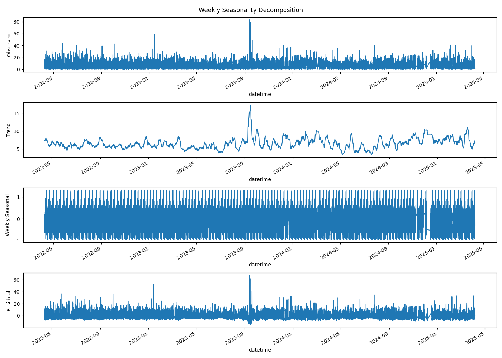
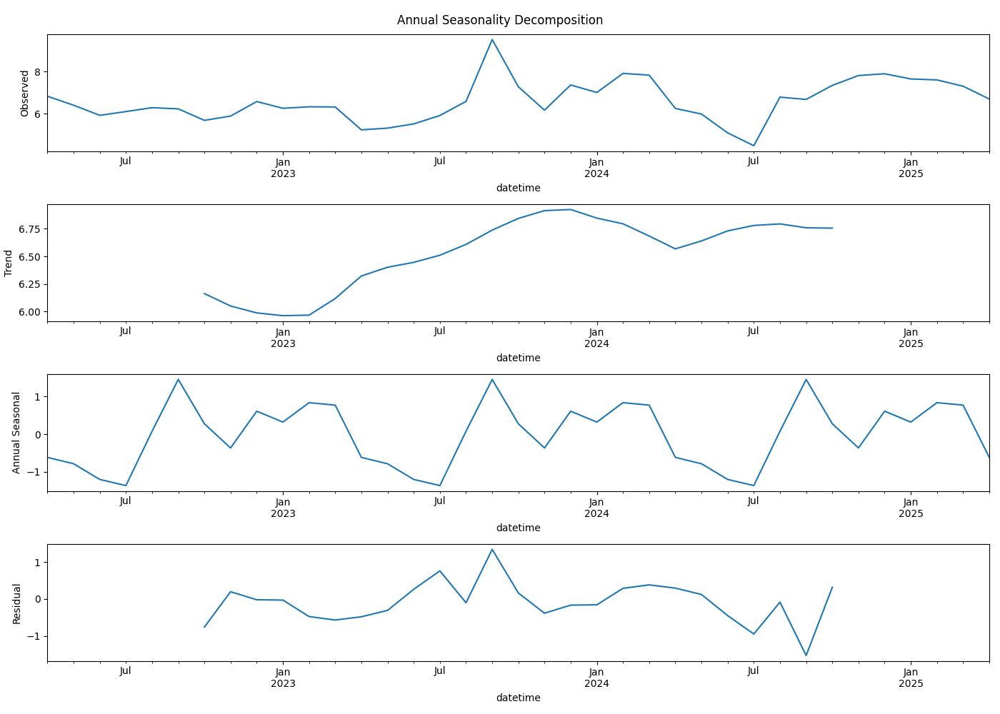
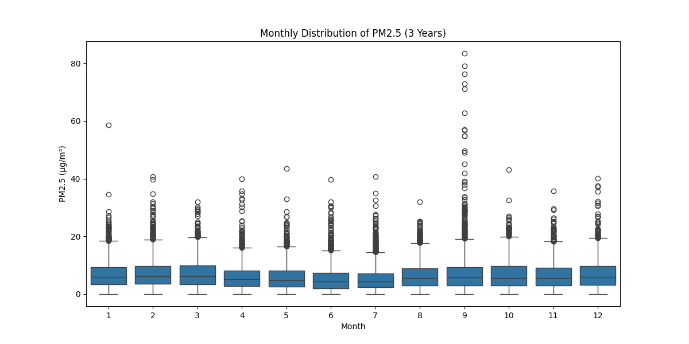
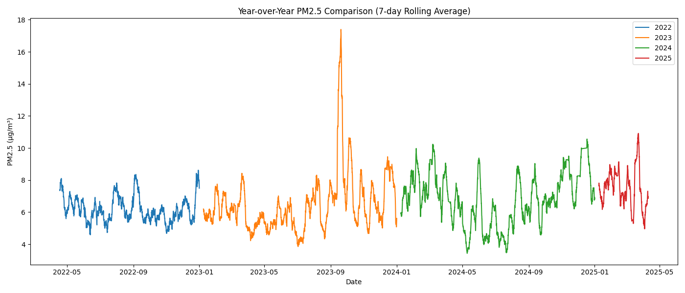

# PM2.5 Air Quality Analysis for Wollongong (2022-2025)

This Python program analyzes PM2.5 air quality data from Wollongong, Australia, covering the period from April 9, 2022 to April 10, 2025. The analysis includes time series examination, seasonal decomposition, correlation studies, and year-over-year comparisons.

## Features

- Data cleaning and preprocessing
- Time series visualization (daily and monthly averages)
- Correlation analysis between meteorological factors and PM2.5
- Seasonal decomposition (weekly and annual patterns)
- Monthly distribution analysis
- Year-over-year comparison

## Requirements

- Python 3.6+
- Required packages:
- Pandas
- Matplotlib
- Seaborn
- Statsmodels
- Numpy

## Installation

1. Clone this repository or download the script
2. Create a virtual environment:
   ```
   python -m venv .venv
   ```
3. Activate the virtual environment:
   - On macOS/Linux:
     ```
     source .venv/bin/activate
     ```
   - On Windows:
     ```
     .venv\Scripts\activate
     ```
4. Install the required dependencies:
   ```
   pip install pandas openpyxl matplotlib seaborn statsmodels numpy
   ```

## Data Source

The program expects an Excel file named `Wollongong_09042022_10042025.xlsx` with the following columns:
- Date (DD/MM/YYYY format)
- Time (HH:MM format)
- Temperature (°C)
- Wind speed (m/s)
- PM2.5 concentration (µg/m³)
- Humidity (%)

## Analysis Outputs

### 1. Time Series Trends

- Shows the daily and monthly average PM2.5 concentrations over the 3-year period
- Helps identify long-term trends and seasonal patterns

### 2. Feature Correlations

- Displays correlation coefficients between PM2.5 and meteorological factors
- Uses 7-day rolling averages to smooth short-term fluctuations

### 3. Weekly Seasonality

- Breaks down the PM2.5 time series into:
- Observed values
- Long-term trend
- Weekly seasonal component
- Residuals

### 4. Annual Seasonality

- Shows the annual seasonal pattern using monthly averaged data
- Reveals yearly cycles in PM2.5 concentrations

### 5. Monthly Distribution

- Displays the distribution of PM2.5 values for each month
- Highlights seasonal variations and outliers

### 6. Year-over-Year Comparison

- Compares PM2.5 levels across different years
- Uses 7-day rolling averages for smoother comparison

## Key Findings

1. **Data Quality**:
 - The program automatically handles negative PM2.5 values (removing them from analysis)
 - Fixes datetime conversion issues (especially for midnight values)

2. **Temporal Patterns**:
 - PM2.5 shows clear seasonal variation
 - Weekly patterns may reflect human activity cycles
 - Annual patterns may relate to weather conditions

3. **Relationships**:
 - The correlation heatmap reveals how PM2.5 relates to temperature, wind speed, and humidity

