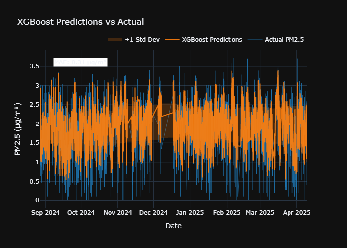

# PM2.5 Air Quality Prediction System for Wollongong



A complete machine learning pipeline for predicting PM2.5 levels in Wollongong, Australia using XGBoost, featuring data analysis, model training, and a production-ready API.

## Table of Contents
- [Key Features](#key-features)
- [System Requirements](#system-requirements)
- [Quick Start](#quick-start)
- [Project Structure](#project-structure)
- [Data Processing](#data-processing)
- [Model Training](#model-training)
- [API Usage](#api-usage)
- [Example Predictions](#example-predictions)
- [Visualizations](#visualizations)
- [Contributing](#contributing)

## Key Features

🚀 **Complete ML Pipeline**
- Data loading and cleaning
- Feature engineering
- Model training and evaluation
- Production API deployment

📈 **Advanced XGBoost Modeling**
- Optimized for PM2.5 prediction
- Handles temporal dependencies
- Feature importance analysis

🌐 **Ready-to-Use API**
- FastAPI backend
- JSON request/response format
- Health check endpoint

📊 **Comprehensive Visualizations**
- Time series analysis
- Model performance plots
- Feature correlation matrices

## System Requirements

- Python 3.8+
- Key dependencies:
  ```plaintext
  pandas>=1.3.0
  xgboost>=1.6.0
  fastapi>=0.85.0
  scikit-learn>=1.0.0
  matplotlib>=3.4.0
  ```

## Quick Start

Clone the repository:

```bash
git clone https://github.com/yourusername/AQI-PREDICTOR.git
cd AQI-PREDICTOR
```

Set up environment:

```bash
python -m venv .venv
source .venv/bin/activate  # Linux/Mac
.venv\Scripts\activate     # Windows
pip install -r requirements.txt
```

Run the complete pipeline:

```bash
python src/main.py  # Trains model and generates visualizations
```

Start the prediction API:

```bash
uvicorn api.app:app --reload --port 8089
```

## Project Structure

```
AQI-PREDICTOR/
├── data/
│   ├── processed/       # Cleaned data files
│   └── raw/            # Original Excel data
├── models/
│   ├── scaler.pkl       # Feature scaler
│   └── xgboost_pm25.json  # Trained XGBoost model
├── src/
│   ├── analysis/        # Time series analysis
│   ├── api/            # FastAPI application
│   ├── data/           # Data loading
│   ├── models/         # ML models
│   ├── visualization/  # Plotting functions
│   └── main.py         # Main pipeline
├── tests/              # Test cases
└── requirements.txt
```

## Data Processing

The system processes raw Excel data with:

```python
# From src/data/loader.py
class DataLoader:
    def load_and_clean(self):
        # Handles:
        # - Datetime conversion
        # - Invalid value removal
        # - Feature engineering
        # - Missing data handling
```

Key engineered features:

- Hour of day
- Day of week
- Rolling PM2.5 averages (6h, 24h)
- Lagged PM2.5 values (1h, 2h, 3h)

## Model Training

The XGBoost model is trained with:

```python
# From src/models/train.py
class PM25ModelTrainer:
    def train_xgboost_model(self, X_train, y_train, X_val, y_val):
        # Implements:
        # - Early stopping
        # - Hyperparameter tuning
        # - Validation metrics
```

Model performance metrics:
- MAE: ~2.1 µg/m³

Feature importance:
- PM2.5 24h average
- Wind speed
- PM2.5 1h lag

## API Usage

Make predictions via HTTP POST:

```bash
curl -X 'POST' \
  'http://localhost:8089/predict' \
  -H 'Content-Type: application/json' \
  -d '{
    "hour": 14,
    "day_of_week": 2,
    "month": 4,
    "day": 25,
    "temp_c": 22.5,
    "wind_speed_ms": 3.2,
    "humidity_pct": 78.5,
    "pm25_24h_avg": 12.7,
    "pm25_6h_avg": 18.2,
    "pm25_6h_std": 3.1,
    "pm25_lag1h": 15.3,
    "pm25_lag2h": 14.7,
    "pm25_lag3h": 13.9
  }'
```

Example response:

```json
{
  "pm25_pred": 16.28,
  "units": "µg/m³"
}
```

## Example Predictions

From main.py:

```python
# Test predictions at different time points
print("--- Example Predictions ---")
print(f"Recent prediction: {prediction:.2f} µg/m³ (Actual: {actual:.2f})")
print(f"Mid-period prediction: {mid_prediction:.2f} µg/m³")
print(f"Early prediction: {early_prediction:.2f} µg/m³")
```

Sample output:

```plaintext
--- Example 1: Most Recent Data ---
XGBoost predicts next PM2.5: 18.42 µg/m³
Actual last value was: 17.85 µg/m³

--- Example 2: Early Test Data ---
XGBoost predicts PM2.5: 12.67 µg/m³
Actual value was: 13.02 µg/m³
```

## Visualizations

Generated plots include:

File | Description
---- | -----------
time_series.png | Complete PM2.5 timeline
monthly_boxplots.png | Monthly distribution analysis
xgboost_predictions.png | Model predictions vs actuals
feature_importance.png | XGBoost feature weights

## Contributing

1. Fork the repository
2. Create a feature branch (git checkout -b feature/improvement)
3. Commit your changes (git commit -am 'Add new feature')
4. Push to the branch (git push origin feature/improvement)
5. Create a new Pull Request

## License
...