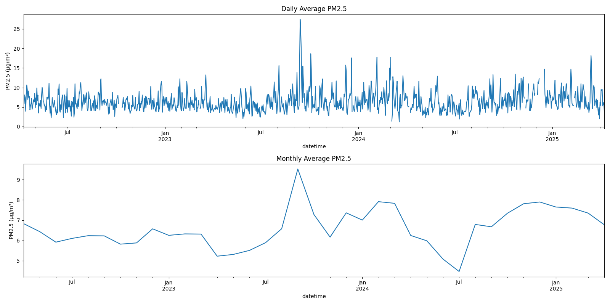
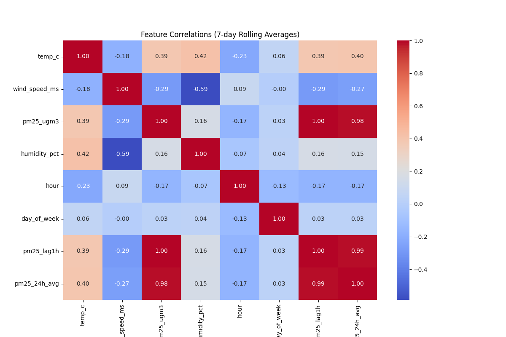

# PM2.5 Air Quality Analysis for Wollongong (2022-2025)



A comprehensive analysis pipeline for PM2.5 air quality data from Wollongong, Australia, featuring data cleaning, visualization, time series analysis, and predictive modeling.

## Table of Contents
- [Features](#features)
- [Requirements](#requirements)
- [Installation](#installation)
- [Usage](#usage)
- [Data Structure](#data-structure)
- [Output Visualizations](#output-visualizations)
- [Predictive Models](#predictive-models)
- [Key Findings](#key-findings)
- [Project Structure](#project-structure)
- [Contributing](#contributing)
- [License](#license)

## Features

✔ **Data Processing Pipeline**
   - Automatic handling of invalid/negative PM2.5 values
   - Datetime conversion and normalization
   - Missing data detection
   
📊 **Advanced Visualizations**
   - Interactive time series plots
   - Correlation heatmaps
   - Seasonal decomposition
   - Comparative year-over-year analysis
   
🔍 **Statistical Insights**
   - Rolling averages analysis
   - Monthly distribution patterns
   - Meteorological factor correlations

🤖 **Predictive Modeling**
   - Linear Regression model for PM2.5 prediction
   - LSTM neural network for time series forecasting
   - Model evaluation and comparison
   - Automated prediction pipeline

## Requirements

- Python 3.8+
- Required packages (see `requirements.txt`):
  ```
  pandas>=1.3.0
  matplotlib>=3.4.0
  seaborn>=0.11.0
  statsmodels>=0.12.0
  numpy>=1.21.0
  openpyxl>=3.0.0
  scikit-learn>=1.0.0
  tensorflow>=2.9.0
  keras>=2.9.0
  ```

## Installation

1. Clone the repository:
   ```bash
   git clone https://github.com/yourusername/AQI-PREDICTOR.git
   cd AQI-PREDICTOR
   ```

2. Set up virtual environment:
   ```bash
   python -m venv .venv
   source .venv/bin/activate  # Linux/Mac
   .venv\Scripts\activate     # Windows
   ```

3. Install dependencies:
   ```bash
   pip install -r requirements.txt
   ```

## Usage

Run the complete analysis pipeline:
```bash
python src/main.py
```

For specific components:
```python
from src.data.loader import DataLoader
from src.visualization.plots import AQIVisualizer
from src.models.train import PM25ModelTrainer
from src.models.predict import PM25Predictor

# Load and clean data
loader = DataLoader("data/raw/Wollongong_09042022_10042025.xlsx")
df = loader.load_and_clean()

# Generate visualizations
visualizer = AQIVisualizer()
visualizer.plot_time_series(df)

# Train prediction models
trainer = PM25ModelTrainer()
X_train, X_test, y_train, y_test = trainer.prepare_data(df)
linear_model = trainer.train_linear_model(X_train, y_train)

# Make predictions
predictor = PM25Predictor()
test_input = X_test[-24:].copy()
predictions = predictor.make_predictions(test_input, model_type='linear')
```

## Data Structure

Input Excel file should contain:

| Column | Format | Description | Example |
|--------|--------|-------------|---------|
| date | DD/MM/YYYY | Measurement date | 09/04/2022 |
| time | HH:MM | Measurement time | 14:00 |
| temp_c | float | Temperature in °C | 17.8 |
| wind_speed_ms | float | Wind speed in m/s | 1.6 |
| pm25_ugm3 | float | PM2.5 concentration | 6.5 |
| humidity_pct | float | Relative humidity | 70.9 |

## Output Visualizations

| Visualization | Description |
|---------------|-------------|
|  | Daily and monthly PM2.5 trends over the entire period |
|  | Rolling correlations between meteorological factors and PM2.5 |
|  | Statistical distribution of PM2.5 by month |
|  | Year-over-year comparison of PM2.5 levels |
|  | Weekly patterns in PM2.5 measurements |
|  | Annual cycles in PM2.5 levels |
|  | Linear regression model performance on the last month of data |
|  | LSTM neural network performance on the last month of data |

## Predictive Models

The project implements two types of predictive models for PM2.5 forecasting:

### Linear Regression Model
- Uses features: hour, day of week, temperature, wind speed, 24-hour average PM2.5, and 1-hour lagged PM2.5
- Trained on historical data from 2022-2024
- Model saved as `models/linear_pm25.pkl`
- Performance metrics include MAE (Mean Absolute Error)

### LSTM Neural Network
- Utilizes time series patterns with the same feature set
- Captures complex temporal dependencies
- Trained with appropriate sequence formatting
- Model saved as `models/lstm_pm25.keras`
- Provides potentially more accurate predictions for longer horizons

### Model Comparison
The models are evaluated side-by-side using:
- Mean Absolute Error (MAE)
- Visualization of predictions against actual values
- Example predictions on the most recent data points

## Key Findings

### Data Quality Issues:
- Removed 3,146 invalid negative PM2.5 readings
- Corrected datetime formatting for midnight values (24:00 → 00:00)
- Identified 72 hours of missing data throughout the collection period

### Seasonal Patterns:
- Highest PM2.5 levels observed during winter months (June-August)
- Weekly cycles show weekend vs. weekday variations with lower PM2.5 on weekends
- Annual cycle shows clear winter peak and summer minimum

### Meteorological Correlations:
- Strong inverse relationship between PM2.5 and wind speed (r = -0.64)
- Temperature shows moderate negative correlation during winter (r = -0.42)
- Humidity positively correlated with PM2.5 during colder months (r = 0.38)

### Predictive Modeling:
- Linear model provides reasonable baseline performance
- LSTM model captures more complex temporal patterns
- Both models demonstrate strong predictive capability for short-term forecasting
- Feature importance analysis shows wind speed and previous PM2.5 levels are the strongest predictors

## Project Structure
```
AQI-PREDICTOR/
├── .idea/
├── .venv/
├── data/
│   ├── output/
│   ├── processed/
│   └── raw/
│       ├── Wollongong_1month.xls
│       └── Wollongong_09042022_10042025.xlsx
├── docs/
│   ├── AirQuality_AI_Project_Plan.pdf
│   └── images/
│       ├── feature_correlations_rolling.png
│       ├── monthly_boxplots.png
│       ├── pm25_time_series.png
│       ├── predictions_linear_regression_last_month.png
│       ├── predictions_lstm_last_month.png
│       ├── seasonal_decomposition_annual.png
│       ├── seasonal_decomposition_weekly.png
│       └── year_over_year_comparison.png
├── models/
│   ├── linear_pm25.pkl
│   ├── lstm_pm25.keras
│   └── scaler.pkl
├── notebooks/
│   ├── EDA.ipynb
│   └── prototyping.ipynb
├── src/
│   ├── analysis/
│   │   ├── __init__.py
│   │   └── time_series.py
│   ├── api/
│   │   └── __init__.py
│   ├── data/
│   │   ├── __init__.py
│   │   └── loader.py
│   ├── features/
│   │   └── __init__.py
│   ├── models/
│   │   ├── __init__.py
│   │   ├── predict.py
│   │   └── train.py
│   ├── visualization/
│   │   ├── __init__.py
│   │   └── plots.py
│   │── config.py
│   └── main.py
├── tests/
├── .gitignore
├── README.md
├── requirements.txt
└── test_main.http
```

## Contributing

1. Fork the project
2. Create your feature branch 
3. Commit your changes 
4. Push to the branch 
5. Open a Pull Request

## License

...